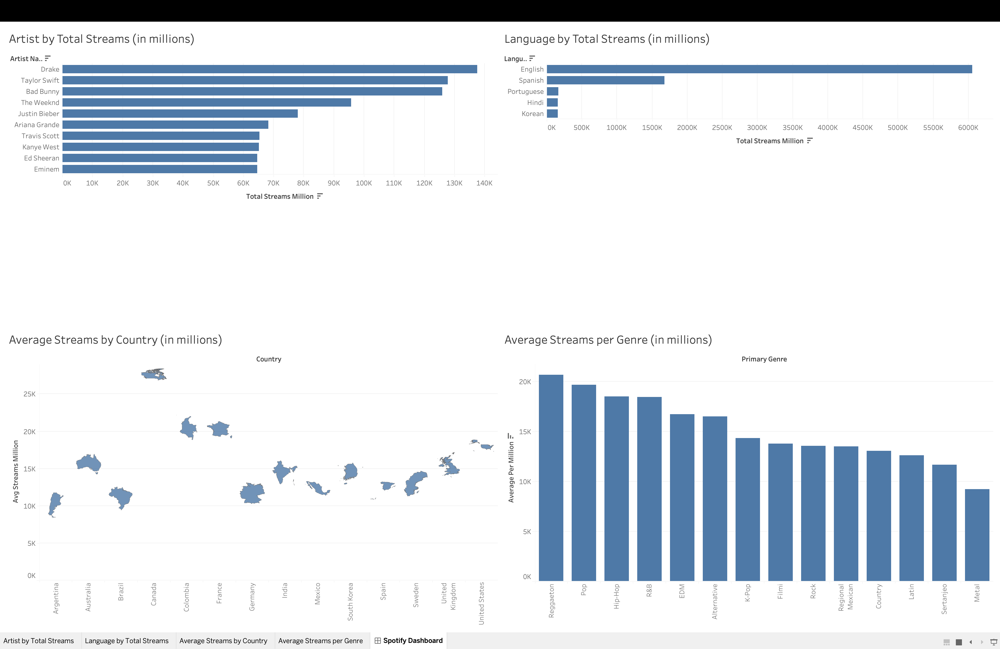

# Spotify Analytics ETL with dbt and DuckDB

An analytics engineering project that transforms a raw Spotify artist dataset into tested, analysis-ready tables. The project uses dbt to load a CSV seed, standardize the source data, and build marts for comparing streaming performance across artists, languages, genres, and countries.

## Project goals

- Practice the complete analytics engineering workflow with dbt
- Turn inconsistent source columns into a clean, documented data model
- Apply data quality tests to important dimensions and measures
- Visualize the final marts in an interactive Tableau dashboard

## Tech stack

- **Transformation:** dbt Core 1.12
- **Database:** DuckDB
- **Source:** Spotify artist data from Kaggle
- **Visualization:** Tableau
- **Planned orchestration:** Apache Airflow

## Data pipeline

```text
raw_spotify.csv
       |
       v
raw_spotify (dbt seed)
       |
       v
stg_spotify__artists
       |
       v
dim_artist__summary
       |
       +-- dim_artist_by__streams
       +-- dim_language_by__streams
       +-- dim_streams_by__genre
       +-- dim_streams_by__country
```

The staging model standardizes column names and replaces missing lead, feature, and solo stream values with zero. The artist summary model provides one analysis-ready row per artist, while the downstream marts answer specific analytical questions.

## Tableau dashboard



The dashboard visualizes the four analytical marts with artist and language rankings, average streams by country, and average streams by genre.

[Download the packaged Tableau workbook](dashboards/spotify_analytics_dashboard.twbx)

## Models

| Layer | Model | Purpose |
| --- | --- | --- |
| Seed | `raw_spotify` | Loads the source CSV into DuckDB |
| Staging | `stg_spotify__artists` | Renames source columns and handles missing stream values |
| Mart | `dim_artist__summary` | Provides the cleaned artist-level dataset |
| Mart | `dim_artist_by__streams` | Returns the top 10 artists by total streams |
| Mart | `dim_language_by__streams` | Returns the top 5 languages by total artist streams |
| Mart | `dim_streams_by__genre` | Compares average streams for genres represented by at least five artists |
| Mart | `dim_streams_by__country` | Compares average streams for countries represented by at least five artists |

The five-artist threshold reduces the effect of very small groups when comparing genre and country averages.

## Data quality

The project uses dbt tests to check:

- Artist names and mart dimensions are unique and not null
- Stream measures required for analysis are not null
- Artist type contains only the accepted values `Solo` or `Group`

Run `dbt build` to build the complete lineage and execute its tests together.

## Getting started

### 1. Create and activate a virtual environment

From the repository root:

```bash
python3 -m venv venv
source venv/bin/activate
pip install dbt-core dbt-duckdb
```

### 2. Configure the DuckDB profile

Create or update `~/.dbt/profiles.yml`:

```yaml
spotify_analytics:
  target: dev
  outputs:
    dev:
      type: duckdb
      path: dev.duckdb
      threads: 1
```

### 3. Build the project

```bash
cd spotify_analytics
dbt debug
dbt seed
dbt build
```

DuckDB allows only one process to write to the database at a time. Disconnect `dev.duckdb` from database extensions or query tools before running dbt if a file-lock error appears.

### 4. Explore the results

Preview a model from the command line:

```bash
dbt show --select dim_artist_by__streams
```

Generate and open the dbt documentation and lineage graph:

```bash
dbt docs generate
dbt docs serve
```

## Repository structure

```text
etl-practice/
├── dashboards/
│   ├── spotify_analytics_dashboard.png   # Dashboard preview
│   └── spotify_analytics_dashboard.twbx  # Packaged Tableau workbook
├── docs/                         # Project notes and roadmap
├── spotify_analytics/
│   ├── models/
│   │   ├── staging/              # Source cleanup and standardization
│   │   └── marts/                # Analysis-ready models
│   ├── exports/                   # Mart CSVs consumed by Tableau
│   ├── seeds/raw_spotify.csv     # Raw source dataset
│   └── dbt_project.yml           # dbt project configuration
└── README.md
```

## Next steps

- Publish the dashboard to Tableau Public
- Automate the pipeline with Apache Airflow
- Automate the Tableau CSV export and refresh workflow
- Add continuous integration so every change runs `dbt build`
